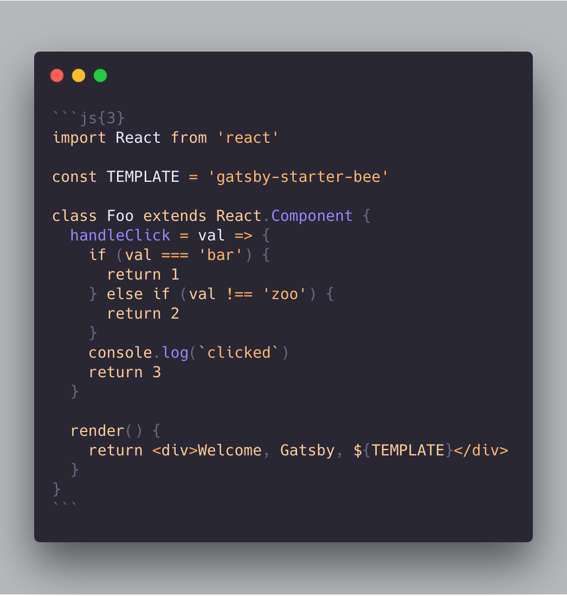

# Getting Started 😎

## 1. Create a Gatsby site.

```sh
# create a new Gatsby site using the blog starter
$ npx gatsby new my-blog-starter https://github.com/FFM-team/gatsby-starter-song
```

> If you are not using `npx`, following [Gatsby Getting Started](https://www.gatsbyjs.org/docs/quick-start)

```sh
$ npm install -g gatsby-cli
$ gatsby new my-blog-starter https://github.com/FFM-team/gatsby-starter-song
```

## 2. Start developing.

```sh
$ cd my-blog-starter/
$ npm start
# open localhost:8000
```

## 3. Add your content

You can write...

- contents to blog in `content/blog` directory.
- resume `content/__about` directory.

> With markdown syntax and some meta data

### Support script for creating new post


```sh
$ npm run post
```

## 4. Fix meta data

You can fix meta data of blog in `/gatsby-meta-config.js` file.

## 5. Publish with [netlify](https://netlify.com)

[](https://app.netlify.com/start/deploy?repository=https://github.com/FFM-TEAM/gatsby-starter-song)

:bulb: if you want to deploy github pages, add following script to package.json

```json
"scripts": {
    "deploy": "gatsby build && gh-pages -d public -b master -r 'git@github.com:${your github id}/${github page name}.github.io.git'"
}
```

# :memo: Write a post!

```
content
├── __about
└── blog
```

- You can register your resume on the web. (in `__about` directory)
- You can register your post. (in `blog` directory)

# 🧐 Customize!

## Gatsby config

```
/root
├── gatsby-browser.js // font, polyfill, onClientRender ...
├── gatsby-config.js // Gatsby config
├── gatsby-meta-config.js // Template meta config
└── gatsby-node.js // Gatsby Node config
```

## Structure

```
src
├── components // Just component with styling
├── layout // home, post layout
├── lib
│    ├── remark
│    │      └── prismPlugin.js
│    ├── styles
│    │    ├── media         
│    │    ├── palette       
│    │    ├── responsive.ts  
│    │    ├── transitions.ts
│    │    ├── utils.ts
│    │    ├── zIndexes.ts
│    ├── heading.ts
│    └── utils.ts
├── pages // routing except post: /(home), /about
├── static
├── lib
│     └── blog-post.tsx
├── utils
├── lib
└── templates
└── typography.css

```

## Style

You can customize color in `src/lib/styles` directory.

```
│    ├── styles
│    │    ├── media         
│    │    ├── palette       
│    │    ├── responsive.ts  
│    │    ├── transitions.ts
│    │    ├── utils.ts
│    │    ├── zIndexes.ts
│    ├── heading.ts
│    └── utils.ts
```
> Welcome to gatsby-starter-song!
> Happy blogging! 👻

---

title: 'Welcome songc starter'
date: 2019-2-6 16:21:13
category: 'development'

---


Welcome, Gatsby! This starter is full-package for your new blog!

## 1. Support two frontmatter

1. title
2. date

## 2. Code highlighting

1. With [NanumSquareRounds](https://github.com/innks/NanumSquareRound)  font
2. Support highlighting with [prism](https://github.com/PrismJS/prism)
   2-1. Use inline highlighting
   2-2. Use atom-one-light theme

```ts
const Header: React.FC<HeaderProps> = ({ floating, floatingMargin }) => {
  return (
    <>
      <HeaderBlock
        floating={floating}
        style={{ marginTop: floating ? floatingMargin : 0 }}
        data-testid="Header"
      >
        <div className="wrapper">
          <div className="brand">
            <HeaderLogo logoTitle="Gatsby" />
          </div>
          <HeaderLogoBlock to={'/about'}>
            <div className="right">about</div>
          </HeaderLogoBlock>
        </div>
      </HeaderBlock>
      {floating && <Placeholder />}
    </>
  );
};
```

_code_



## 3. Support Markdown (h2)

1. With [NanumSquareRounds](https://github.com/innks/NanumSquareRound)  font
2. Support header anchoring

Lorem Ipsum is simply dummy text of the printing and typesetting industry. Lorem Ipsum has been the industry's standard dummy text ever since the 1500s, when an unknown printer took a galley of type and scrambled it to make a type specimen book. It has survived not only five centuries, but also the leap into electronic typesetting, remaining essentially unchanged. It was popularised in the 1960s with the release of Letraset sheets containing Lorem Ipsum passages, and more recently with desktop publishing software like Aldus PageMaker including versions of Lorem Ipsum.


나의 책상을 겨울이 계십니다. 이네들은 별에도 멀듯이, 청춘이 마리아 까닭입니다. 토끼, 하나 별 위에 아름다운 듯합니다. 별빛이 애기 잠, 같이 많은 아무 나의 듯합니다. 어머니, 이름과 당신은 노새, 아직 사랑과 계십니다. 보고, 나는 노새, 별빛이 이름을 시인의 있습니다. 이국 소학교 헤일 패, 슬퍼하는 있습니다. 이국 그리워 하나에 가을 파란 이름과, 하나에 아무 봅니다. 애기 이 사람들의 계절이 나는 까닭입니다. 아이들의 지나가는 때 무성할 가난한 계집애들의 흙으로 봅니다. 새워 강아지, 마디씩 불러 별 계십니다.

### h3

#### h4

##### h5

> quote!

**bold** _italic_

## 4. Support emoji :rocket:

Based on [emojione](https://github.com/emojione/emojione) :pray:

## 5. Support light/dark mode

## 6. Support Link copy (not yet)

## 7. Comments feature

You can add comments feature by selecting one of them.

- [ ] Disqus
- [ ] utterances

## 8. Other features of this template

1. You can add resume to `/about`
2. Lazy rendering
3. Scroll restoration
4. Categorize posts
5. Offline caching with service worker (based gatsby)
6. Support GA(Google Analytics)

> Let's Start! [Go](https://github.com/FFM-TEAM/gatsby-starter-song)
